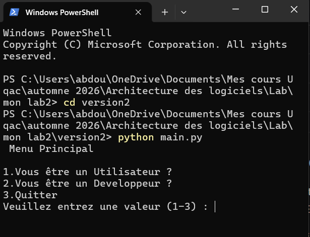
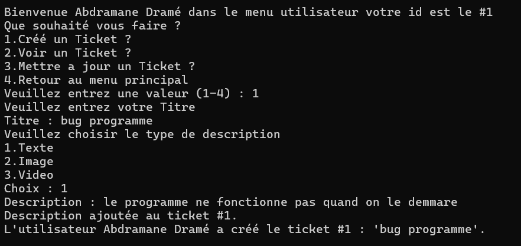
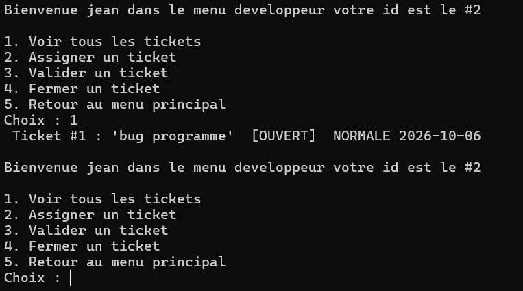
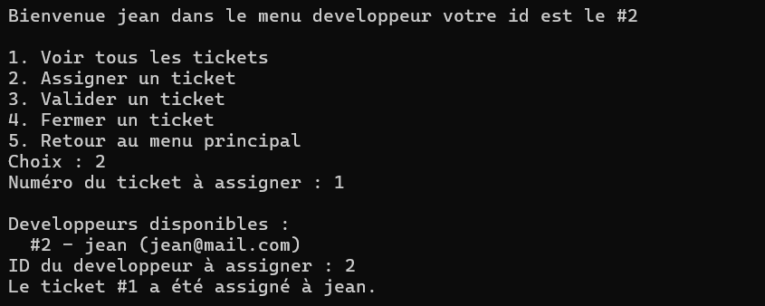
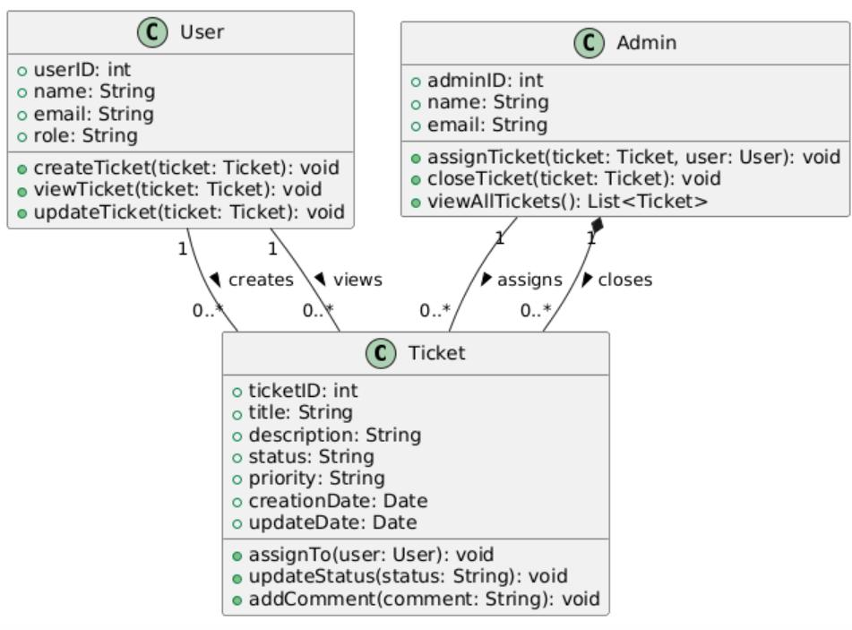
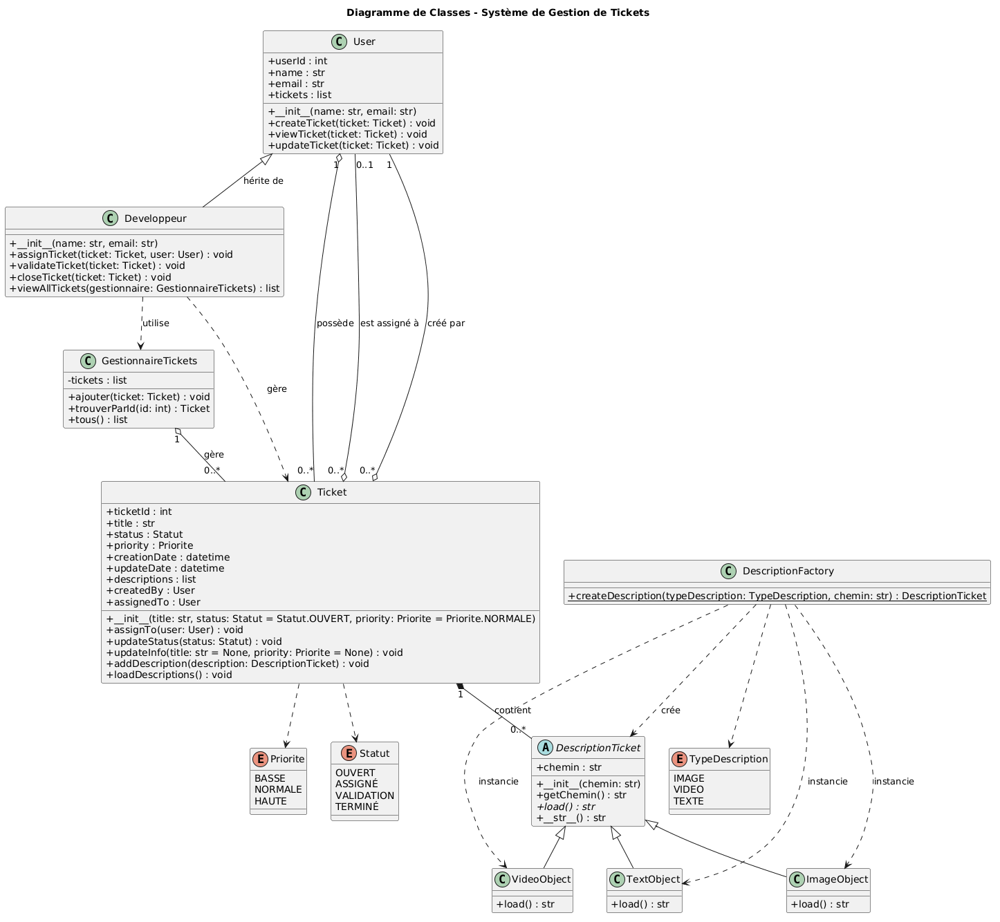

# 6GEI311 – Lab 2 : Système de Gestion de Tickets

**Abdramane Dramé (DRAA04070300)**

Ce dépôt contient le travail du Lab 2 pour le cours 6GEI311 – Architecture des logiciels.

## 1. Installation et utilisation

### Installation

Il faut juste **Python 3.8 ou plus récent**.

git clone [https://github.com/abdouldrame09/6GEI311_Laboratoire2.git]
cd 6GEI311_Laboratoire2

### Utilisation

cd version2
python main.py

Le programme propose un menu pour :
- **Utilisateur** : créer, voir et modifier des tickets.
- **Développeur** : voir, assigner, valider et fermer des tickets.

Contenu du dépôt :
- version1/ : code de la partie 1
- version2/ : code de la partie 2
- captures/ : capture d'écran du programme
- DiagrammeUML.png : diagramme de classes final
- codeplantuml.txt : code PlantUML
- Rapport lab2.pdf : rapport complet

## 2. Ce que j'ai appris

Ce laboratoire m'a permis d'apprendre plusieurs choses importantes.

D'abord, j'ai compris qu'il faut toujours bien lire l'énoncé avant de concevoir un diagramme. Plusieurs problèmes du diagramme initial venaient du fait qu'il ne respectait pas le texte.

Ensuite, j'ai découvert les principes GRASP :
- **Expert en information** : placer chaque responsabilité dans la bonne classe.
- **Fabrication pure** : créer des classes utilitaires comme Factory et Gestionnaire.
- **Faible couplage** : éviter les dépendances directes entre classes.
- **Protégé des variations** : utiliser des énumérations et le polymorphisme.
- **Forte cohésion** : une classe = une responsabilité claire.

J'ai aussi appris à utiliser le polymorphisme pour gérer plusieurs types de descriptions (texte, image, vidéo) de manière uniforme, sans avoir à modifier le reste du code.
Enfin, j'ai compris que la conception et le code doivent aller ensemble : un bon diagramme donne un bon code.

## 3. Résultats

### Fonctionnalités

## 1. Menu principal

## 2. Connexion Utilisateur

## 3. Création d'un ticket

## 4. Affichage d'un ticket avec ses descriptions

## 5. Connexion Développeur

## 6. Voir tous les tickets

## 7. Assigner un ticket à un développeur

## 8. Valider un ticket

## 9. Fermer un ticket

### Diagramme UML — Partie 1

Diagramme initial avec plusieurs problèmes : classe Admin incohérente, god class Ticket, méthodes vides, types inadaptés.

### Diagramme UML — Partie 2

Diagramme final avec :
- Héritage Developpeur vers User
- Classe abstraite DescriptionTicket + sous-classes
- DescriptionFactory
- GestionnaireTickets
- Enums Statut, Priorite, TypeDescription

Voir DiagrammeUML.png et codeplantuml.txt

## Auteur

**Abdramane Dramé** – https://github.com/abdouldrame09
